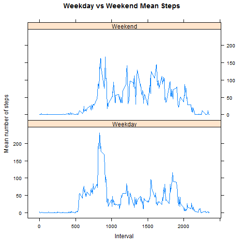

# Reproducible Research: Peer Assessment 1

## Loading and preprocessing the data
We first load the necessary packages:

```r
library(plyr)
library(lattice)
```

We then begin the data processing by unzipping and loading the data.

```r
data <- read.csv(unz("activity.zip", "activity.csv"))
```

## What is mean total number of steps taken per day?
To calculate the total number of steps taken each day, we use the plyr package. We first create a new data frame that sums the steps per day.

```r
dailySum <- ddply(data, .(date), summarize, daily.sum=sum(steps, na.rm=TRUE))
```

We then plot a hostogram of the above:

```r
hist(dailySum$daily.sum, xlab='Steps per Day', col='red', 
     main='Histogram of Steps per Day')
```

 

Finally we calculate the mean and the median of the total steps per day:

```r
meanDailySteps <- mean(dailySum$daily.sum, na.rm=TRUE)
medianDailySteps <- median(dailySum$daily.sum, na.rm=TRUE)

meanDailySteps
```

```
## [1] 9354
```

```r
medianDailySteps
```

```
## [1] 10395
```

## What is the average daily activity pattern?
Again use plyr to creat a summary data table, this time summarizing with respect to activity period:

```r
intervalSum <- ddply(data, .(interval), summarize, 
                     interval.mean=mean(steps, na.rm=TRUE))
```

Plotting this as time series data gives us a view of how activity chanegs during the day:

```r
plot(intervalSum$interval, intervalSum$interval.mean,type='l', xlab='Interval',
     ylab='Mean number of steps', main='Daily Mean Steps')
```

 

The interval with the maximum number of steps is given below.

```r
maxIntevalSteps <- max(intervalSum$interval.mean)
intervalSum[which(intervalSum$interval.mean==maxIntevalSteps), 'interval']
```

```
## [1] 835
```

## Imputing missing values
How many rows with missing data are there?

```r
NARows <- is.na(data$steps)
numberOfNARows <- sum(NARows)
numberOfNARows
```

```
## [1] 2304
```

We then replace missing steps with means for corresponding interval, producing a new data set.

```r
NARowsIndices <- which(NARows)
for(idx in NARowsIndices) {
  data$steps[[idx]] <- intervalSum[intervalSum$interval==data$interval[[idx]], 'interval.mean']
}
```

Repeating the steps from the first section, we now get updated summary statistics for the daily data.

```r
dailySum <- ddply(data, .(date), summarize, daily.sum=sum(steps, na.rm=TRUE))
hist(dailySum$daily.sum, xlab='Steps per Day', col='red', 
     main='Histogram of Steps per Day')
```

 

```r
meanDailySteps <- mean(dailySum$daily.sum, na.rm=TRUE)
medianDailySteps <- median(dailySum$daily.sum, na.rm=TRUE)

meanDailySteps
```

```
## [1] 10766
```

```r
medianDailySteps
```

```
## [1] 10766
```

Note that the distribution of daily steps appears much less skewed, a fact seen both in the hisogram and also in the values of the mean and median, which are now equal to one another.

## Are there differences in activity patterns between weekdays and weekends?
We begin by adding variables to the data set. First, day of the week:

```r
data$days <- weekdays(strptime(data$date,format='%Y-%m-%d'))
```

Next we need to add variable denoting whether or a particular days is a weekend:

```r
weekend <- function(x) {
  isWeekend = 'Weekday'
  if (x == 'Saturday' | x == 'Sunday') {
    isWeekend = 'Weekend'
  }
  else {
    isWeekend = 'Weekday'
  }
  isWeekend
}
for (idx in 1:nrow(data)) {
  data$is.weekend[idx] <- weekend(data$days[idx])
}
```

We now need to provide a summary of interval activity for weekends vs weekdays. Using plyr we create a new data frame.

```r
intervalSumDays <- ddply(data, .(interval, is.weekend), summarize, 
                     interval.mean=mean(steps, na.rm=TRUE))
```

Finally we produce a lattice plot shwoing the difference in weekday vs weekend activity.

```r
xyplot(interval.mean ~ interval | is.weekend, data = intervalSumDays, 
       layout = c(1,2), type='l', xlab = 'Interval', ylab='Mean number of steps', 
       main='Weekday vs Weekend Mean Steps')
```

 

Weekend activity is clearly different from weekday activity.
